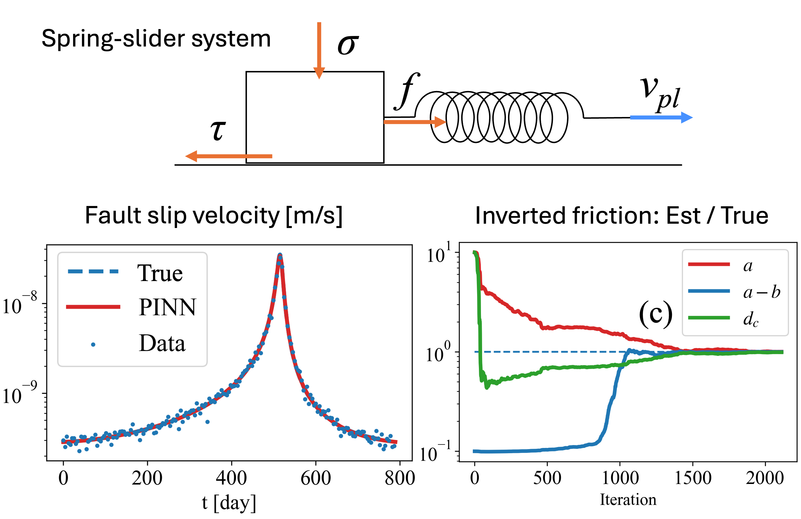
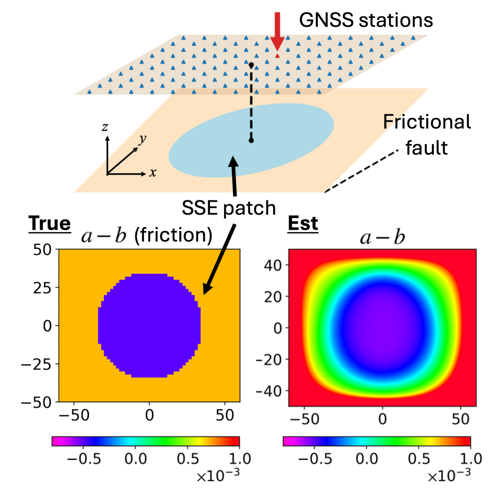
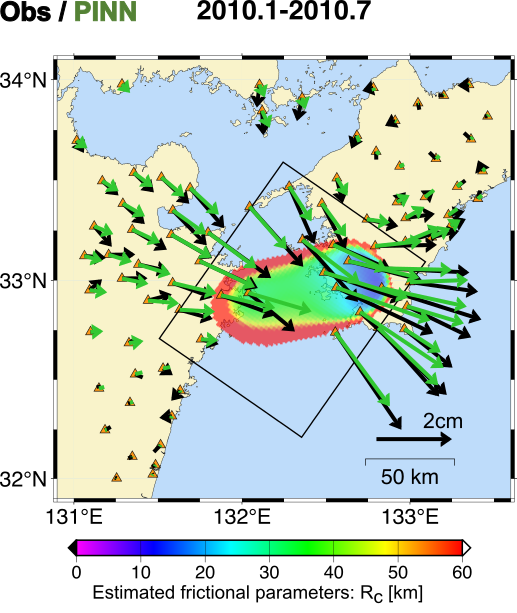

<ol style="font-size:16px; color:black">
  Slow slip events (SSEs) observed in many subduction zones are understood to result from frictional unstable slip on the plate interface. Yet methods to determine the spatial variation of these properties from observations have been lacking. This series of work develops and progressively applies Physics-Informed Neural Networks (PINNs) to bridge this gap, moving from an idealized system (spring-slider / 2D fault), through synthetic validation, to a real-data inversion.

  ### 1. Spring-Slider System

  <!-- <figure style="width: 400px; max-width: 100%; margin: 0 auto; text-align: center;">
    
    <figcaption style="font-size: 14px; line-height: 1.4;">Frictional parameter estimation from slip velocity observation</figcaption>
  </figure> -->

  <figure style="float: right; width: 430px; max-width: 45%; margin: 0 24px 10px 0; text-align: center;">
    
    <!-- <figcaption style="font-size: 14px; line-height: 1.4;">Numerical experiments to estimate the frictional parameters from 3D SSE</figcaption> -->
  </figure>

  [Fukushima et al. (2023)](https://doi.org/10.1029/2023JB027384) establishes the foundational methodology using a spring-slider system with rate and state friction. It demonstrates that a PINN can simultaneously simulate the physics of frictional slip by solving the governing differential equations, estimate the underlying frictional parameters from observations, and predict the evolution of slow slip events from inverted parameters. This controlled setting provides a proof-of-concept, showing that PINNs can be applied to the forward and inverse problem of fault slip modeling with rate and state friction law. 

  ### 2. 3D SSE: Synthetic test

  <figure style="float: left; width: 320px; max-width: 45%; margin: 0 24px 10px 0; text-align: center;">
    
    <!-- <figcaption style="font-size: 14px; line-height: 1.4;">Numerical experiments to estimate the frictional parameters from 3D SSE</figcaption> -->
  </figure>

  [Fukushima et al. (2025)](https://doi.org/10.1029/2024JB030256) extends the approach to spatially variable friction using a synthetic model inspired by the long-term SSEs observed in the Bungo Channel. Beginning with an idealized case in which fault slip is directly observed, it then advances to a more realistic scenario using synthetic surface displacement velocity data recorded at virtual GNSS stations. The geometry and friction properties of the velocity-weakening region, where slip instability develops, are well recovered—particularly when observations are located above that region. In this framing, the PINN acts as an inversion technique regularized by the requirement that fault slip obey a physical friction law, thereby overcoming the reliance on non-physical constraints inherent in standard regularization approaches.

  

  ### 3. Application to 2010 Bungo SSE

  <figure style="float: right; width: 320px; max-width: 45%; margin: 0 24px 10px 0; text-align: center;">
    
    <!-- <figcaption style="font-size: 14px; line-height: 1.4;">Frictional parameter estimation from slip velocity observation</figcaption> -->
  </figure>

  [Fukushima et al. (2026)](https://doi.org/10.48550/arXiv.2601.20136) applies the method to real observations, targeting the 2010 Bungo SSE in southwest Japan. By using a neural network to represent the spatially variable frictional properties, they make the otherwise high-dimensional optimization feasible while fully incorporating fault mechanics. Their estimation reveals heterogeneous friction coinciding with localized SSE nucleation in southwest Shikoku and its subsequent westward propagation, and the resulting fault slip reproduces the observed spatio-temporal pattern of surface displacements. By systematically determining the model parameters from observations, this approach further helps elucidate the physical mechanisms of SSEs through a quantitative assessment of the limitations of the assumed fault physics. Together, these results demonstrate the potential of PINNs for advancing fault mechanics and enabling physics-based fault slip forecasting.

  

</ol>

<section style="margin-top: 2.5em; padding-top: 1em; border-top: 1px solid #e5e7eb;">
  <h2 style="font-size: 15px; font-weight: 600; letter-spacing: 0.04em; text-transform: uppercase; margin: 0 0 0.6em 0;">References</h2>
  <ol style="font-size: 13.5px; line-height: 1.5; margin: 0; padding-left: 1.5em;">
    <li style="margin: 0 0 0.6em 0; padding-left: 0;">
      Fukushima, R., Kano, M., &amp; Hirahara, K. (2023). Physics-informed neural networks for fault slip monitoring: Simulation, frictional parameter estimation, and prediction on slow slip events in a spring-slider system. <em>Journal of Geophysical Research: Solid Earth</em>, 128, e2023JB027384. <a href="https://doi.org/10.1029/2023JB027384">doi:10.1029/2023JB027384</a>
    </li>
    <li style="margin: 0 0 0.6em 0; padding-left: 0;">
      Fukushima, R., Kano, M., Hirahara, K., Ohtani, M., Im, K., &amp; Avouac, J.-P. (2025). Physics-informed deep learning for estimating the spatial distribution of frictional parameters in slow slip regions. <em>Journal of Geophysical Research: Solid Earth</em>, 130, e2024JB030256. <a href="https://doi.org/10.1029/2024JB030256">doi:10.1029/2024JB030256</a>
    </li>
    <li style="margin: 0; padding-left: 0;">
      Fukushima, R., Kano, M., Hirahara, K., &amp; Ohtani, M. (2026). Physics-informed deep learning links geodetic data and fault friction. <em>arXiv</em>:2601.20136. <a href="https://doi.org/10.48550/arXiv.2601.20136">doi:10.48550/arXiv.2601.20136</a>
    </li>
  </ol>
</section>

